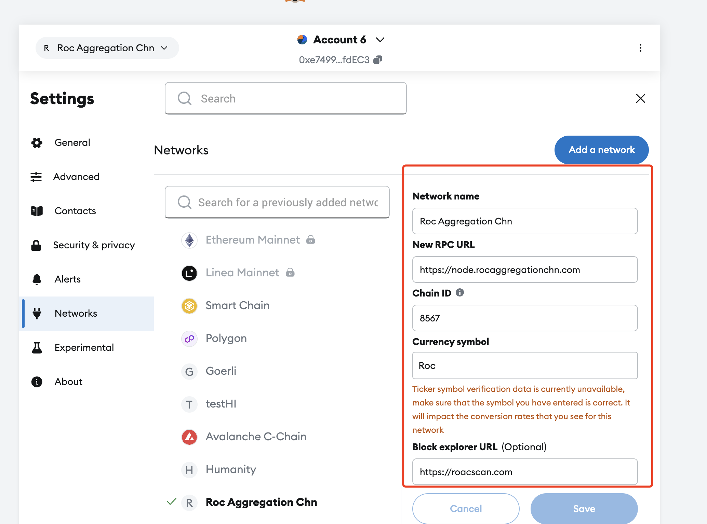
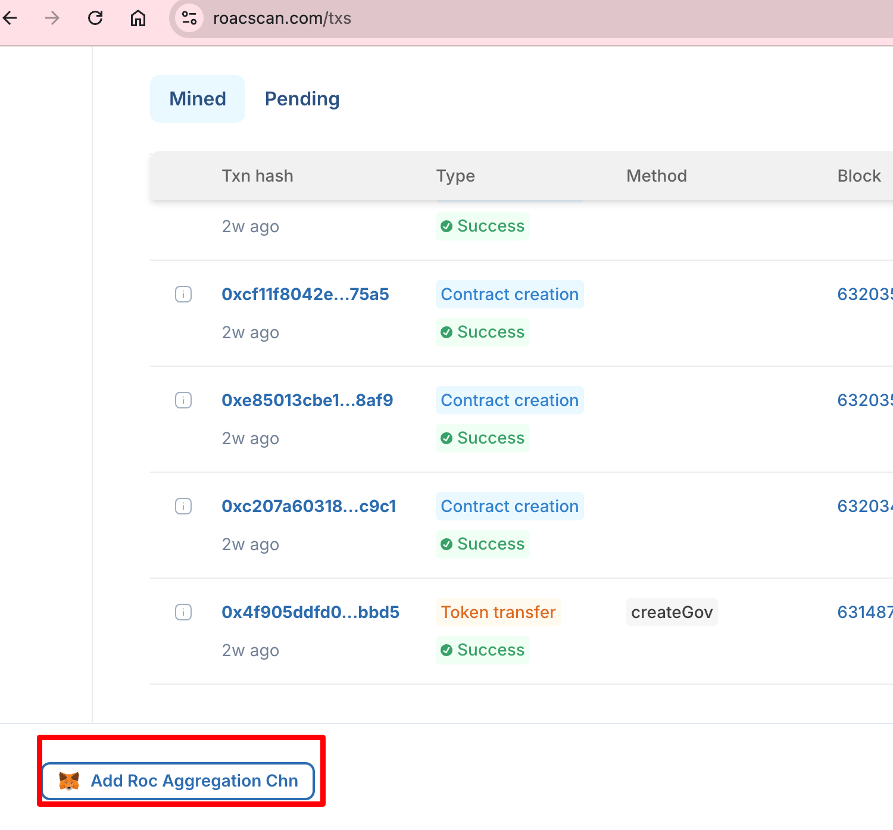

## 添加 rocaggregationchn 到 metamask
1. 安装metamask 钱包到浏览器  
https://chromewebstore.google.com/detail/metamask/nkbihfbeogaeaoehlefnkodbefgpgknn?hl=en-US&utm_source=ext_sidebar
2. 创建钱包保存助记词
3. 添加network  

4. 填写网络信息


## 网络信息
Network name: Roc Aggregation Chn  
New RPC URL: https://node.rocaggregationchn.com  
Chain Id: 8567  
Currency symbol: Roc  
Block explorer URL: https://roacscan.com  

## 可以通过区块链浏览器快速添加网络
浏览器URL：https://roacscan.com


## genesis.json
```
{
  "config": {
    "chainId": 8567,
    "homesteadBlock": 0,
    "eip150Block": 0,
    "eip155Block": 0,
    "eip158Block": 0,
    "byzantiumBlock": 0,
    "constantinopleBlock": 0,
    "petersburgBlock": 0,
    "istanbulBlock": 0,
    "berlinBlock": 0,
    "clique": {
      "period": 3,
      "epoch": 30000
    }
  },
  "difficulty": "1",
  "gasLimit": "8000000",
  "extradata": "0x000000000000000000000000000000000000000000000000000000000000000036e336eee8d304824cde637713a725b910bb2b4e0000000000000000000000000000000000000000000000000000000000000000000000000000000000000000000000000000000000000000000000000000000000",
  "alloc": {
    "36e336eee8d304824cde637713a725b910bb2b4e": { "balance": "207500000000000000000000000" }
  }
}
```