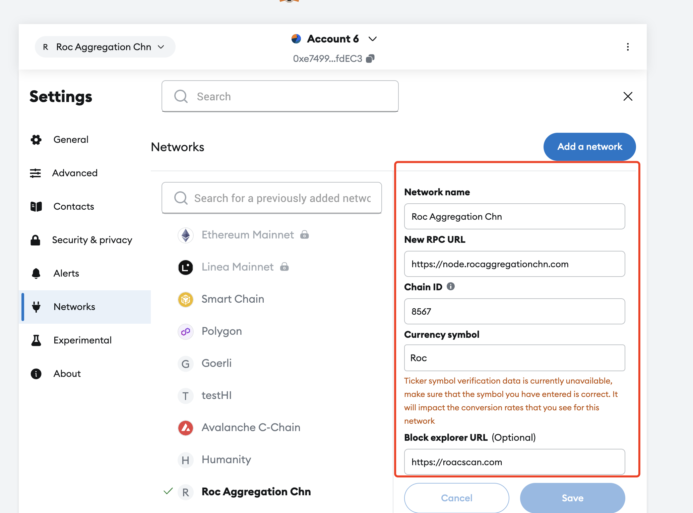
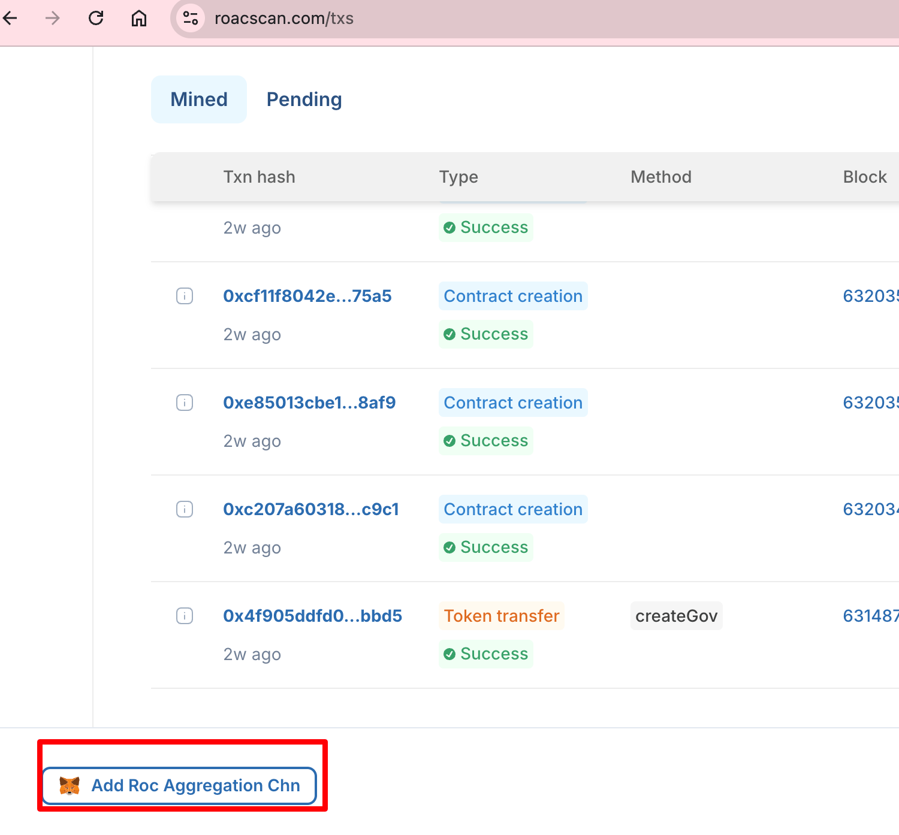

## add rocaggregationchn to metamask
1. Install the MetaMask Wallet in Your Browser
https://chromewebstore.google.com/detail/metamask/nkbihfbeogaeaoehlefnkodbefgpgknn?hl=en-US&utm_source=ext_sidebar
2. Create Wallet and Save Recovery Phrase
3. Add netowrk

4. Fill in Network Information


## network infomation
Network name: Roc Aggregation Chn  
New RPC URL: https://node.rocaggregationchn.com  
Chain Id: 8567  
Currency symbol: Roc  
Block explorer URL: https://roacscan.com  

## You can quickly add networks through a blockchain explorer.
Block explorer: URL：https://roacscan.com


## genesis.json
```
{
  "config": {
    "chainId": 8567,
    "homesteadBlock": 0,
    "eip150Block": 0,
    "eip155Block": 0,
    "eip158Block": 0,
    "byzantiumBlock": 0,
    "constantinopleBlock": 0,
    "petersburgBlock": 0,
    "istanbulBlock": 0,
    "berlinBlock": 0,
    "clique": {
      "period": 3,
      "epoch": 30000
    }
  },
  "difficulty": "1",
  "gasLimit": "8000000",
  "extradata": "0x000000000000000000000000000000000000000000000000000000000000000036e336eee8d304824cde637713a725b910bb2b4e0000000000000000000000000000000000000000000000000000000000000000000000000000000000000000000000000000000000000000000000000000000000",
  "alloc": {
    "36e336eee8d304824cde637713a725b910bb2b4e": { "balance": "207500000000000000000000000" }
  }
}
```


## Building the source

Building `geth` requires both a Go (version 1.19 or later) and a C compiler. You can install
them using your favourite package manager. Once the dependencies are installed, run

```shell
make geth
```

or, to build the full suite of utilities:

```shell
make all
```


### Hardware Requirements

Minimum:

* CPU with 2+ cores
* 4GB RAM
* 1TB free storage space to sync the Mainnet
* 8 MBit/sec download Internet service

Recommended:

* Fast CPU with 4+ cores
* 16GB+ RAM
* High-performance SSD with at least 1TB of free space
* 25+ MBit/sec download Internet service


